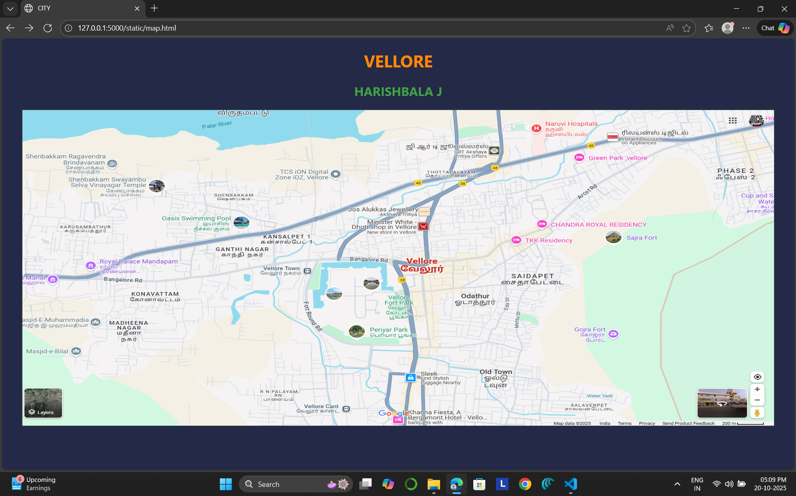
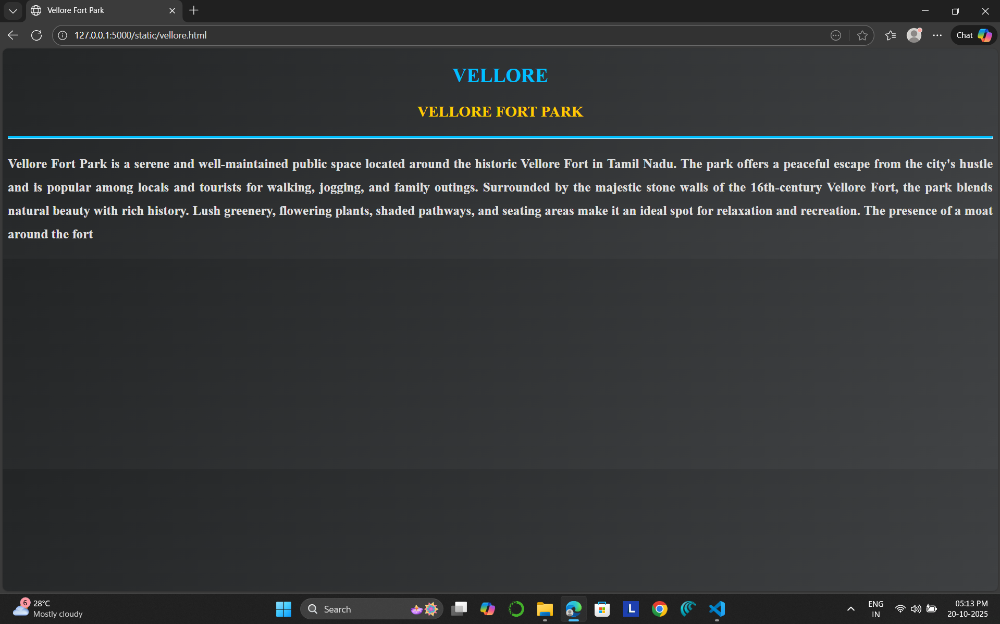
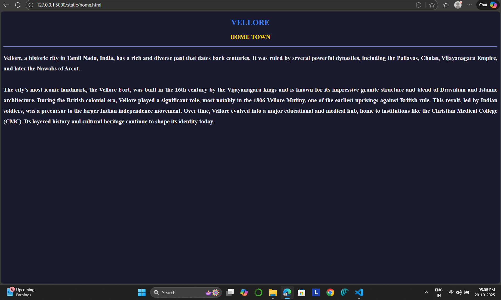
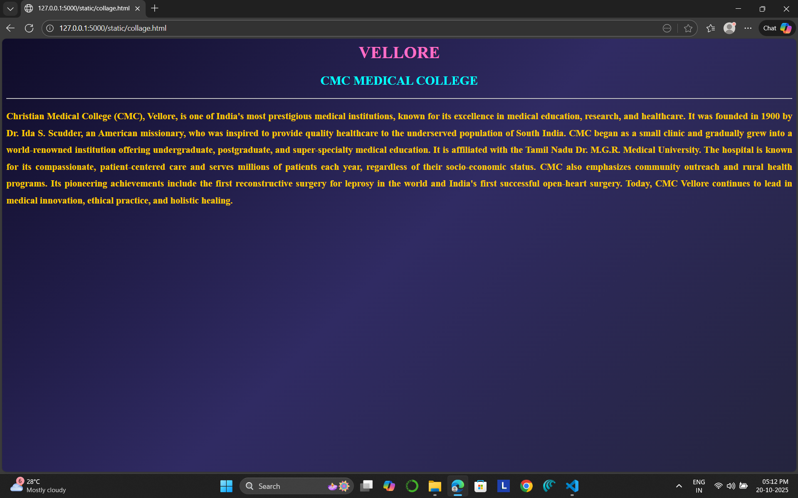

# Ex04 Places Around Me
## Date: 20/10/2025

## AIM
To develop a website to display details about the places around my house.

## DESIGN STEPS

### STEP 1
Create a Django admin interface.

### STEP 2
Download your city map from Google.

### STEP 3
Using ```<map>``` tag name the map.

### STEP 4
Create clickable regions in the image using ```<area>``` tag.

### STEP 5
Write HTML programs for all the regions identified.

### STEP 6
Execute the programs and publish them.

## CODE
```
map.html:
<!DOCTYPE html>
<html>
    <head>
        <title>CITY</title>
        <style>
            body {
                text-align: center;
                background: #232946; 
                color: #eebbc3;      
                font-family: 'Segoe UI', Arial, sans-serif;
            }
            h1 {
                color: #ff8906;      
                font-weight: bold;
            }
            h2 {
                color: #43a047;
                font-weight: bold;
            }
            img {
               height: 610;
               width: 1450;
                border: 2px solid #2d3748;
            
            }
        </style>
    </head>
    <body>
        <h1>VELLORE</h1>
        <h2>HARISHBALA J</h2>
        
        <map name="MyCity">
            <area shape="rect" coords="600,250,850,400" href="home.html" title="MY HOME TOWN">
            <area shape="rect" coords="200,100,500,500" href="collage.html" title="CMC MEDICAL COLLAGE">
            <area shape="rect" coords="1033,330,1202,404" href="vellore.html" alt="college" title="vellore fort park">
            <area shape="rect" coords="1129,468,1356,615" href="place.html" title="saidapet">
            <area shape="rect" coords="61,486,194,564" href="naruvi.html" title="Naruvi">
        </map>
    </body>
</html>

home.html:
<!DOCTYPE html>
<head>
    <style>
        body {
            background-color: #1a1a2e;
            color: #eaeaea;
            
            
            
        }
        h2 {
            color: #3b82f6; 
            text-align: center;
            
        }
        h3 {
            color: #ffd700;
            text-align: center;
            
        }
        hr {
            border: none;
            border-top: 2px solid #8f94fb;
            margin: 18px 0;
        }
        p {
            color: #e9e9e9;
            text-align: justify;
             font-weight: 600;
    line-height: 1.8;
    font-size: 18px;
            
            
            
        }
    </style>
</head>
<body>
    <h2>VELLORE</h2>
    <h3>HOME TOWN</h3>
    <hr>
    <p>
        Vellore, a historic city in Tamil Nadu, India, has a rich and diverse past that dates back centuries. It was ruled by several powerful dynasties, including the Pallavas, Cholas, Vijayanagara Empire, and later the Nawabs of Arcot.
        <br><br>
        The city's most iconic landmark, the Vellore Fort, was built in the 16th century by the Vijayanagara kings and is known for its impressive granite structure and blend of Dravidian and Islamic architecture. During the British colonial era, Vellore played a significant role, most notably in the 1806 Vellore Mutiny, one of the earliest uprisings against British rule. This revolt, led by Indian soldiers, was a precursor to the larger Indian independence movement. Over time, Vellore evolved into a major educational and medical hub, home to institutions like the Christian Medical College (CMC). Its layered history and cultural heritage continue to shape its identity today.
    </p>
</body>
</html>

collage.html:

<html>
    <body>
    <h1>VELLORE</h1>
    <h2>CMC MEDICAL COLLEGE</h2>
    <HR>
        <p>Christian Medical College (CMC), Vellore, is one of India's most prestigious medical institutions, known for its excellence in medical education, research, and healthcare. It was founded in 1900 by Dr. Ida S. Scudder, an American missionary, who was inspired to provide quality healthcare to the underserved population of South India. CMC began as a small clinic and gradually grew into a world-renowned institution offering undergraduate, postgraduate, and super-specialty medical education. It is affiliated with the Tamil Nadu Dr. M.G.R. Medical University. The hospital is known for its compassionate, patient-centered care and serves millions of patients each year, regardless of their socio-economic status. CMC also emphasizes community outreach and rural health programs. Its pioneering achievements include the first reconstructive surgery for leprosy in the world and India's first successful open-heart surgery. Today, CMC Vellore continues to lead in medical innovation, ethical practice, and holistic healing.</p></font>
<style>
body{
background: linear-gradient(135deg,#0f0c29, #302b63, #24243e);


}
h1{
    text-align: center;
    color: #ff6ec7;

}
h2{
    color: #00ffff;
    text-align: center;

}
p{
    text-align: justify;
    color: #ffcc00;
    font-weight: 600;
    line-height: 1.8;
    font-size: 18px;
}


</style>

</body>
</html>

naruvi.html:
<!DOCTYPE html>
<html>
<head>
  <title>Naruvi Hospital - Vellore</title>
  <style>
    body {
      background-color: pink;
      font-family: Arial, sans-serif;
      
    }
    h1 {
      color: blue;
      text-align: center;
    }
    h2 {
      text-align: center;
      color: #333;
    }
    hr {
      
      height: 2px;
      background-color: #333;
      
    }
    p {
      text-align: justify;
      color: #222;
       font-weight: 600;
    line-height: 1.8;
    font-size: 18px;
      
      
    }
  </style>
</head>
<body>
  <h1>VELLORE</h1>
  <h2>NARUVI</h2>
  <hr>
  <p>
    Naruvi Hospital in Vellore is a state-of-the-art multispecialty hospital known for its advanced medical technology and world-class healthcare services. Established with the vision of providing high-quality, patient-centric care, Naruvi is part of the renowned Pearl Health Services and collaborates with international medical institutions. Located in a modern facility, the hospital is equipped with cutting-edge diagnostic and treatment technologies, including robotic surgery, advanced imaging, and critical care units. It offers a wide range of medical specialties such as cardiology, oncology, orthopedics, neurology, and more. Naruvi Hospital emphasizes compassionate care, innovation, and clinical excellence. It also focuses on hygiene, comfort, and a patient-friendly environment, making it a preferred choice for both local residents and those from neighboring regions. The hospital’s team of skilled doctors, nurses, and healthcare professionals are committed to delivering top-tier medical services, contributing to Vellore's reputation as a major healthcare hub in India.
  </p>
</body>
</html>

place.html:
<!DOCTYPE html>
<html>
<head>
  <style>
    body {
      background: linear-gradient(to right, #f8ffae, #43c6ac);
      color: #202020; 
    }
    h1 {
      color: BLUE;
      text-align: center;
      font-weight: bolder;
    }
    h2 {
      text-align: center;
      font-weight: bold;
    }
hr{
    height: 2px;
    background: darkblue;
}


    p {
      text-align: justify;
      color: brown;
       font-weight: 600;
    line-height: 1.8;
    font-size: 20px;
    }
  </style>
</head>
<body>
  <h1>VELLORE</h1>
  <h2>SAIDAPET</h2>
  <hr>
  <p>
    Saidapet in Vellore is a residential and semi-urban locality known for its close-knit community and growing infrastructure. Located within the expanding urban landscape of Vellore city, Saidapet blends traditional Tamil culture with modern development. The area is home to families, small businesses, and local markets, making it a vibrant and self-sufficient neighborhood. It offers easy access to key parts of the city, including educational institutions, hospitals, and shopping areas, making it a convenient place to live. Religious harmony is reflected in the presence of temples, churches, and mosques serving the spiritual needs of the community. Public transport options and road connectivity further enhance its appeal. While not as commercialized as central Vellore, Saidapet maintains a peaceful atmosphere, making it ideal for families and retirees. With ongoing development, the area is slowly transforming, offering better amenities while still preserving its local charm and community-centered lifestyle.
  </p>
</body>
</html>

vellore.html:
<!DOCTYPE html>
<html>
<head>
  <title>Vellore Fort Park</title>
  <style>
    body {
      background: linear-gradient(135deg, #232526 0%, #414345 100%);
      color: #e0e0e0;
      font-size: 20px;
    }
    h2 {
      color: #00bfff;
    }
    h3 {
      color: #ffcc00;
    }
    hr {
      
      border-top: 4px solid #00bfff;
    }
    p{
        text-align: justify;
         font-weight: 600;
    line-height: 1.8;
    font-size: 20px;
    }
  </style>
</head>
<body>
  <h2 align="center">VELLORE</h2>
  <h3 align="center">VELLORE FORT PARK</h3>
  <hr>
  <p>
    Vellore Fort Park is a serene and well-maintained public space located around 
    the historic Vellore Fort in Tamil Nadu. The park offers a peaceful escape 
    from the city's hustle and is popular among locals and tourists for walking, 
    jogging, and family outings. Surrounded by the majestic stone walls of the 
    16th-century Vellore Fort, the park blends natural beauty with rich history. 
    Lush greenery, flowering plants, shaded pathways, and seating areas make it 
    an ideal spot for relaxation and recreation. The presence of a moat around 
    the fort


```

## OUTPUT








## RESULT
The program for implementing image maps using HTML is executed successfully.
